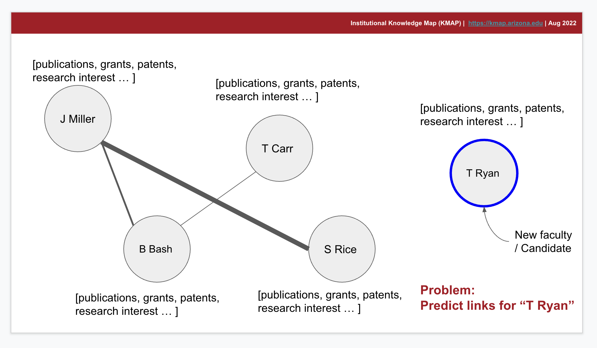

# Link prediction for new faculty

Given a collaboration network of the organization predict links for new faculty members or prospective candidates. 





# Data Description

a collaboration network is a node-edge-weighted graph where each node is a researcher and each edge represents the connection between two researchers. Node weight represents the importance of the node in the organization as a researcher. Edge weight is the strength of the connection between two researchers. 

Each node has the following attributes

- publications
- patents
- grants
- research interests 
- weight 
- kmapId

```
Number of nodes: 4884
Number of edges: 19241
Average degree:   7.8792
```


# Load of the network
The dot file `UArizona_Collaboration_Network.dot` can be loaded as a networkx graph using the following code. 

```python
import networkx as nx 
import pygraphviz as pgv 
G=nx.Graph(pgv.AGraph('UArizona_Collaboration_Network.dot'))
```

The gpickle file can be loaded using the following code:
```python
import networkx as nx 
G=nx.read_gpickle("UArizona_Collaboration_Network.gpickle")
```

# request node attribites

Before accessing our data using the KMAP API please [contact us](https://kmap.arizona.edu/#/contact) to get access to the API Key. Once you receive the access key please use the following instructions to load node attributes.

All the requests should include `{kmapId}` which is the `id` of a node and can be found in the graph as a node attribute.

- publication of a researcher
url - `https://kmap.arizona.edu:8001/api/v0/people/{kmapId}/publications`

- grants of a researcher 
  url -
`https://kmap.arizona.edu:8001/api/v0/people/{kmapId}/grants`


- research interest of a researcher url -
  `https://kmap.arizona.edu:8001/api/v0/people/{kmapId}/research_signature`


Example of the `curl` command
```bash
foo@bar:~$ curl -X 'GET' \
  'https://kmap.arizona.edu:8001/api/v0/people/{kmapId}/publications' \
  -H 'accept: */*'
```

python code
```python
import pandas as pd
df=pd.read_json('https://kmap.arizona.edu:8001/api/v0/people/{kmapId}/publications')

publication=df.loc['publications']['data']
```


# Leaderboard
coming soon!
