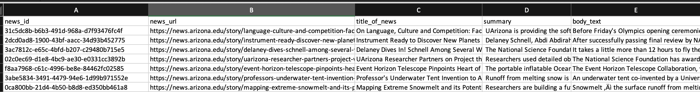
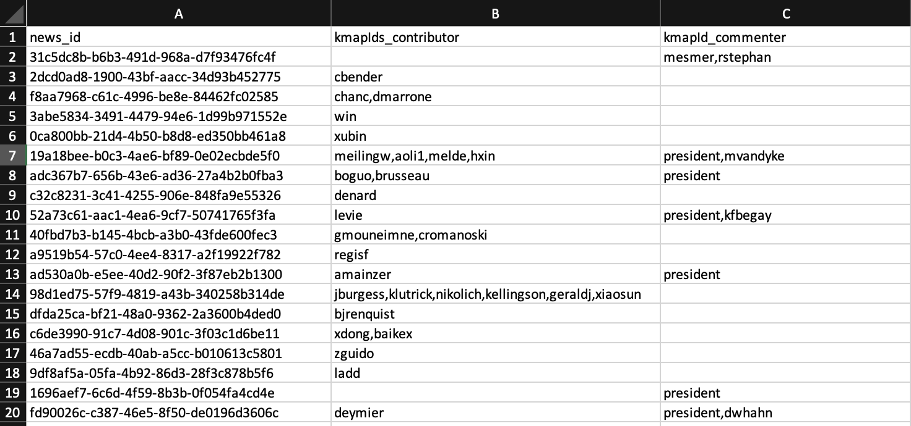
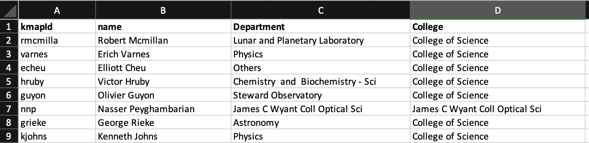

# Identify researchers in the organizational news

Given news details and details of the researcher. This task asks to identify researchers from the news, which is not just retrieving names in the news but also identifying their id in the organization. 
# Chellenges 

- Identifying just names is not sufficient
- People leave the organization
- External people appear in the news
- Name disambiguation
- Understand the context of the news to identify contributors and commenters

# Data

The training set contains 2000 news and their respective commentator and contributors.

The file ` train_news.csv` contains news with columns `news_id`, `news_url`, `title_of_news`, `summary`, `body_text` 

the `train_answer_key.csv` contains the answer for contributors' and commenters' `kmapId`s as comma separated. 

finally, the researcher database can be found in `researcher-data.csv` file. 

<!-- 
# Evaluation Metric -->

# Leaderboard
coming soon!